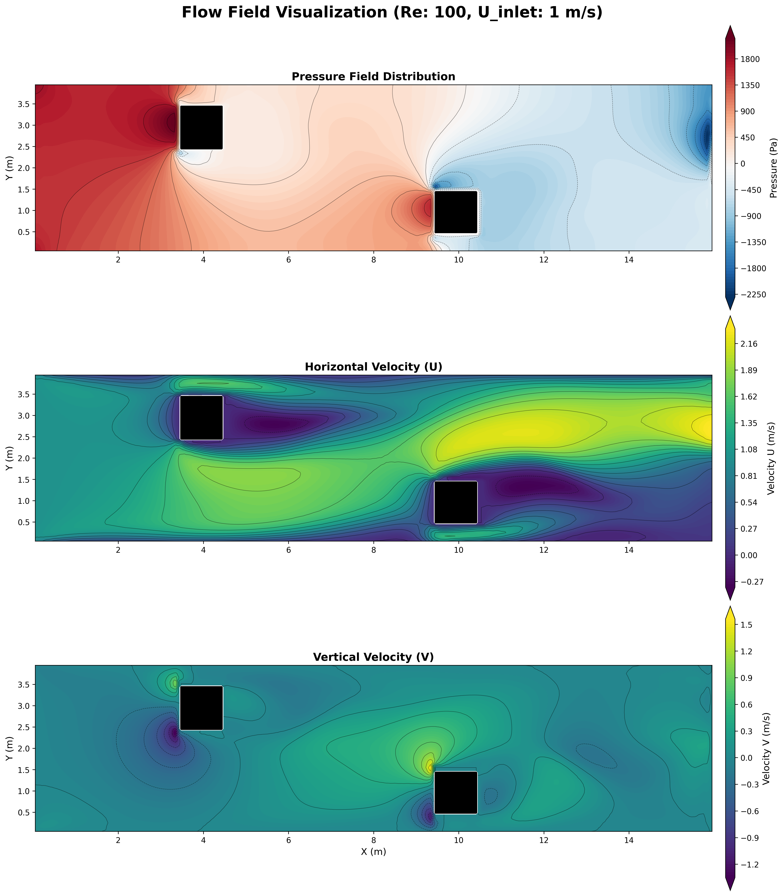

# Flow-over-square-cylinder-using-SIMPLE-algorithm

The present work models a 2D flow around a square cylinder using a finite volume approach with the **Semi-Implicit Method for Pressure-Linked Equations (SIMPLE)**. The analysis focuses on the effect of the **Reynolds number**, determined by the inlet velocity parameters, on the flow behavior around the square cylinder. Velocity profiles, along with the integral drag coefficient, are investigated for laminar flow conditions and validated against published literature [3].

For implementation details and validation results, refer to the technical report:  
📄 [Project Report](doc/Project_Report.pdf)

## Simulation results



---

## How to Run the Solver

1. Define the flow conditions, grid parameters, solver settings, and obstacle geometry (position, size, and number of obstacles) in `src/main.cpp`.
2. Build and run the project using CMake:
```bash
mkdir build && cd build   # Create build directory
cmake ..                  # Configure project
cmake --build .           # Build project
./run_solver              # Run solver
```

References:
1. Suhas V. Patankar, Textbook, Numerical Heat Transfer and
Flud Flow
2. Fadl Moukalled, Luca Mangani, Marwan Darwish (2016)
Implementation of boundary conditions in the finite-volume
pressure-based method—Part I: Segregated solvers,
Numerical Heat Transfer, Part B: Fundamentals, 69:6, 534-562,
DOI: 10.1080/10407790.2016.1138748
3. Breuer, M, Bernsdorf, J., ans T.Zeiser, F. D., 1999. 
“Accurate computations of the laminar flow past a square cylinder
 based on two different methods: lattice boltzmann and
finite-volume
4. H K Versteeg, W Malalasekara, Textbook, An Introduction
to computational Fluid Dynamics, Finite Volume Method
